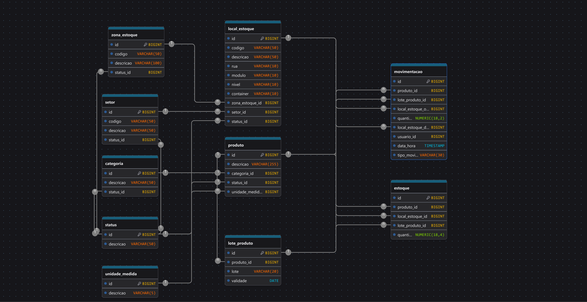

# 📦 Chronos LBM — Warehouse Management System

> **Open-source WMS focado em controle de estoque, movimentações e operações logísticas.**  
> Construído com Java + Spring Boot, projetado para ser simples de integrar e fácil de escalar.

<br>

[](https://opensource.org/licenses/Apache-2.0)
[](https://www.oracle.com/java/)
[](https://spring.io/projects/spring-boot)
[]()

---

## 📋 Sumário

- [Sobre o Projeto](#-sobre-o-projeto)
- [Funcionalidades](#-funcionalidades)
- [Arquitetura e Modelagem](#-arquitetura-e-modelagem)
- [Stack Tecnológica](#-stack-tecnológica)
- [Como Executar](#-como-executar)
- [Variáveis de Ambiente](#-variáveis-de-ambiente)
- [Estrutura do Projeto](#-estrutura-do-projeto)
- [Domínio e Regras de Negócio](#-domínio-e-regras-de-negócio)
- [Roadmap](#-roadmap)
- [Contribuindo](#-contribuindo)
- [Licença](#-licença)
- [Time](#-time)

---

## 🎯 Sobre o Projeto

O **Chronos LBM** é um sistema de gerenciamento de armazém (WMS — *Warehouse Management System*) open-source, desenvolvido com o objetivo de oferecer controle preciso sobre produtos, estoques, lotes, movimentações e a estrutura física do armazém (zonas, setores e locais de estoque).

O projeto nasce com uma visão de longo prazo: evoluir de um sistema de controle de estoque para uma plataforma completa de gestão de operações logísticas, com suporte a regras de armazenagem, rastreabilidade por lote, validade e movimentações auditáveis.

**Por que open-source?**  
Acreditamos que a transparência e a colaboração da comunidade tornam o software mais robusto. O código é livre para uso e modificação sob a licença Apache 2.0. Oferecemos suporte comercial, customizações e implementação para empresas que precisam de uma solução pronta para o seu negócio.

---

## ✅ Funcionalidades

### Implementadas

- Cadastro e gerenciamento de **Produtos** (com categoria, unidade de medida e status)
- Cadastro e gerenciamento de **Categorias** de produtos
- Cadastro de **Lotes** de produtos com controle de validade
- Estrutura física do armazém: **Zonas de Estoque**, **Setores** e **Locais de Estoque**
- Controle de **Status** para entidades do domínio (ativo, inativo, etc.)
- Suporte a **Unidades de Medida** configuráveis
- Tratamento de exceções de domínio padronizado (`EntityNotFoundException`, `StatusInvalidoException`, `DomainException`)

### Em Desenvolvimento / Planejado

- Controle de **Movimentações** de estoque (entrada, saída, transferência)
- Saldo de **Estoque** por produto, lote e local
- Rastreabilidade completa por lote e validade (FEFO/FIFO)
- Autenticação e controle de acesso por usuário
- API de integração com front-end (em desenvolvimento separado)

---

## 🗄️ Arquitetura e Modelagem

### Modelagem do Banco de Dados

O banco de dados foi modelado para suportar a rastreabilidade completa de produtos dentro da estrutura física do armazém.



### Entidades Principais

| Entidade | Tabela | Descrição |
|---|---|---|
| `Produto` | `produto` | Produto cadastrado com categoria, status e unidade de medida |
| `Categoria` | `categoria` | Agrupamento de produtos |
| `UnidadeMedida` | `unidade_medida` | Unidades como KG, UN, CX, L, etc. |
| `Lote` | `lote_produto` | Lote de um produto com número e data de validade |
| `ZonaEstoque` | `zona_estoque` | Divisão macro do armazém (ex: Zona Fria, Zona Seca) |
| `Setor` | `setor` | Subdivisão da zona (ex: Setor A, Setor B) |
| `LocalEstoque` | `local_estoque` | Endereço físico específico (rua, módulo, nível, container) |
| `Estoque` | `estoque` | Saldo atual por produto, lote e local de estoque |
| `Movimentacao` | `movimentacao` | Histórico de todas as movimentações de estoque |
| `Status` | `status` | Tabela imutável de status do sistema |

### Endereçamento de Locais de Estoque

O `LocalEstoque` utiliza uma estrutura de endereçamento em 4 níveis, permitindo localizar fisicamente qualquer item no armazém:

```
ZonaEstoque > Setor > LocalEstoque (Rua > Módulo > Nível > Container)
```

---

## 🛠️ Stack Tecnológica

| Camada | Tecnologia |
|---|---|
| Linguagem | Java 21 |
| Framework | Spring Boot 3.x |
| Persistência | Spring Data JPA / Hibernate |
| Banco de Dados | PostgreSQL (recomendado) / MySQL |
| Validação | Jakarta Bean Validation |
| Lombok | Redução de boilerplate (Getters, Setters, EqualsHashCode) |
| Build | Maven |

---

## 🚀 Como Executar

### Pré-requisitos

- Java 21+
- Maven 3.8+
- PostgreSQL (ou outro banco compatível com JPA)

### 1. Clone o repositório

```bash
git clone https://github.com/LucasFelix-S/chronos-lbm-service.git
cd chronos-lbm-service
```

### 2. Configure as variáveis de ambiente

Crie um arquivo `.env` na raiz ou exporte as variáveis no seu sistema (veja a seção [Variáveis de Ambiente](#-variáveis-de-ambiente)).

### 3. Execute com Maven

```bash
./mvnw spring-boot:run
```

Ou compile e execute o JAR:

```bash
./mvnw clean package
java -jar target/chronos-lbm-service-*.jar
```

### 4. Executando com Docker (em breve)

```bash
docker-compose up
```

> ⚠️ O suporte a Docker Compose está previsto no roadmap.

---

## 🔐 Variáveis de Ambiente

A aplicação utiliza variáveis de ambiente para configuração do banco de dados, evitando a exposição de credenciais no código-fonte.

| Variável | Descrição | Exemplo |
|---|---|---|
| `DB_URL` | URL de conexão JDBC | `jdbc:postgresql://localhost:5432/chronos_wms` |
| `DB_USER` | Usuário do banco de dados | `postgres` |
| `DB_PASSWORD` | Senha do banco de dados | `sua_senha_segura` |

**Exemplo de configuração local (`.env` ou variáveis de sistema):**

```env
DB_URL=jdbc:postgresql://localhost:5432/chronos_wms
DB_USER=postgres
DB_PASSWORD=sua_senha_aqui
```

> 💡 Nunca commite credenciais reais no repositório. O arquivo `.env` já deve estar listado no `.gitignore`.

---

## 📁 Estrutura do Projeto

```
chronos-lbm-service/
├── src/
│   └── main/
│       └── java/io/chronoslbm/wms/
│           └── api/controller
│               ├── controller/     # Endpoints REST (em desenvolvimento)
│           └── domain/
│               ├── enums           # Enumerações
│               ├── model/          # Entidades JPA (Produto, Categoria, Lote, etc.)
│               ├── repository/     # Interfaces Spring Data JPA
│               ├── service/        # Regras de negócio e casos de uso
│               └── exception/      # Exceções de domínio customizadas
├── src/main/resources/
│   └── application.properties      # Configurações da aplicação
├── pom.xml
└── README.md
```

---

## 📐 Domínio e Regras de Negócio

### Validações aplicadas nos Services

- **Produto**: Ao criar ou atualizar, são validados `Status`, `UnidadeMedida` e `Categoria`. Todos devem existir na base e não podem ser nulos.
- **Categoria**: Status é obrigatório e deve ser válido para operações de atualização.
- **Setor**: Status é obrigatório e deve ser válido para operações de atualização.
- **Lote**: Associado a um `Produto` e possui número do lote e data de validade.
- **LocalEstoque**: Endereçado por `ZonaEstoque` e `Setor`, com campos de rua, módulo, nível e container.

### Exceções de Domínio

| Exceção | Quando é lançada |
|---|---|
| `EntityNotFoundException` | Entidade não encontrada pelo ID informado |
| `StatusInvalidoException` | Status nulo ou inexistente na base de dados |
| `DomainException` | Violação de regra de negócio geral |

### Tabelas Imutáveis

`Status` e `UnidadeMedida` são tabelas de domínio com dados pré-carregados (seed), marcadas como `@Immutable` no Hibernate. Não são gerenciadas via CRUD pela API.

---

## 🗺️ Roadmap

- [x] Modelagem do banco de dados
- [x] Entidades de domínio (Produto, Categoria, Lote, Setor, ZonaEstoque, LocalEstoque)
- [x] Services com validações de negócio
- [ ] Controllers REST completos com tratamento de erros padronizado
- [ ] Entidade e service de Movimentação de Estoque
- [ ] Entidade e service de Saldo de Estoque
- [ ] Autenticação com Spring Security / JWT
- [ ] Testes unitários e de integração
- [ ] Documentação de API com Swagger/OpenAPI
- [ ] Suporte a Docker e Docker Compose
- [ ] Integração com front-end (repositório separado)

---

## 🤝 Contribuindo

Contribuições são muito bem-vindas! Este projeto é open-source e se beneficia do conhecimento da comunidade.

### Como contribuir

1. Faça um **fork** do repositório
2. Crie uma **branch** para sua feature ou correção: `git checkout -b feature/minha-feature`
3. Faça seus **commits** com mensagens claras e descritivas
4. Envie um **Pull Request** descrevendo o que foi feito e por quê

### Diretrizes

- Siga as convenções de código Java e o estilo já adotado no projeto
- Adicione validações de domínio consistentes com o padrão existente nos services
- Testes são encorajados, especialmente para regras de negócio críticas
- Abra uma **Issue** antes de implementar grandes mudanças para alinhar com os mantenedores

---

## 📄 Licença

Este projeto está licenciado sob a **Apache License 2.0**.  
Você pode usar, modificar e distribuir livremente, inclusive para fins comerciais, desde que os devidos créditos sejam mantidos e os termos da licença sejam respeitados.

Veja o arquivo [LICENSE](./LICENSE) para mais detalhes.

---

## 👥 Time

| Nome | Papel |
|---|---|
| **Marcos Sérgio** | Product Owner · UX · Especialista em Logística |
| **Bruno Henrique de Faria** | Front-end Developer |
| **Lucas Félix** | Back-end Developer · DBA · Maintainer |

---

<div align="center">
  <sub>Feito com ☕ e muito <code>@Transactional</code> por <strong>Chronos LBM</strong></sub>
</div>
